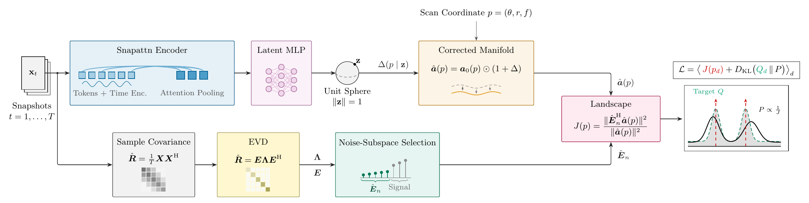

# LEARNING ARRAY SIGNAL TOPOLOGIES AS CONDITIONAL NEURAL MANIFOLDS

[Learning Array Signal Topologies as Conditional Neural Manifolds](https://arxiv.org/abs/2609.18616)

## Abstract

Subspace methods such as multiple signal classification (MUSIC) achieve super-resolution direction
of arrival (DoA) estimation by exploiting the orthogonality between the array manifold and the noise
subspace of the measurements. Their accuracy therefore depends on the assumed manifold and degrades
under model mismatch, while parameters not identifiable from the spatial manifold cannot be
recovered. In this work, we propose the conditional neural manifold (CNM), which replaces the fixed
manifold with an observation-conditioned mapping from source parameters to steering vectors. An
encoder maps the snapshots to a latent scene representation that conditions a zero-initialized
neural field over the parameter space. The manifold is learned without steering-vector supervision
by shaping the resulting MUSIC landscape. Since the correction acts on the manifold rather than on
the estimator, it can be used by other manifold-based methods without modification. The CNM
restores resolution under array imperfections, colored noise, correlated sources, and near-field
propagation, and resolves the angle-frequency ambiguity inherent to the nominal spatial manifold.

## Method

<p align="center">
  <picture>
    <source media="(prefers-color-scheme: dark)" srcset="assets/method_dark.png">
    
  </picture>
</p>

The snapshots take two paths. The lower path is classical MUSIC: sample covariance, eigenvalue
decomposition, noise-subspace selection. The upper path encodes the same snapshots into a latent
scene representation `z` on the unit sphere, which conditions a zero-initialized neural field
producing the corrected manifold `â(p) = a₀(p) ⊙ (1 + Δ(p | z))` at any scan coordinate
`p = (θ, r, f)`. The two paths meet in the unchanged MUSIC null test `J(p) = ‖Êₙᴴ â(p)‖² / ‖â(p)‖²`,
and training shapes that landscape against a target rather than regressing an estimate. With `Δ = 0`
the pipeline *is* classical MUSIC.

## Overview

This repository consists of the following Python scripts:

```text
cnmmusic/                     the library
├── config.py                 default configuration and the dict -> argparse -> wandb merge helpers
├── evaluate.py               Monte-Carlo benchmark harness sweeping one scenario axis over all methods
├── methods.py                method registry building any estimator from a spec string
├── scenarios.py              the scenarios, as one-axis-at-a-time probes around a common base point
├── sweep.py                  Weights & Biases hyperparameter sweeps over the training pipeline
├── train.py                  trains and evaluates the models implemented in PyTorch Lightning
├── visualize.py              publication-quality plotting (spectra, geometries, eigenvalues, roots)
├── archs/                    the neural architectures
│   ├── baselines.py          learned DoA baselines (SubspaceNet, DA-MUSIC, GridCNN)
│   ├── correction.py         the observation-conditioned steering-vector correction
│   ├── encoder.py            observation encoders h(X) (GRU, covariance, lag-cov, attention, mean-set)
│   ├── layers.py             building blocks (SIREN sine layers, FiLM conditioning, Fourier features)
│   ├── manifold.py           the learned manifold-separation generator
│   └── music.py              differentiable MUSIC and Root-MUSIC layers
├── arrays/                   the array physics
│   ├── geometry.py           array geometry abstraction and factories
│   ├── imperfections.py      imperfection models generating ground-truth perturbed manifolds
│   └── steering.py           differentiable far- and near-field steering-vector construction
├── criteria/                 the training and evaluation criteria
│   ├── losses.py             landscape losses for the conditional manifold generator
│   └── metrics.py            permutation-invariant wrapped RMSPE and resolution probability
├── data/                     the data generation
│   ├── dataModules.py        Lightning data modules wrapping the simulator
│   └── simulator.py          batched array-signal simulator emitting the full sample contract
├── estimators/               the estimators, behind one batched interface
│   ├── base.py               the estimator base class to inherit from
│   ├── beamform.py           beamforming with (learned) steering vectors and output-SINR measures
│   ├── classical.py          MUSIC, Root-MUSIC, ESPRIT, MVDR, MLE, smoothing, joint and oracle variants
│   ├── nearfield.py          near-field (joint angle and distance) estimators
│   ├── neural.py             the learned estimators, including CNM under its several back-ends
│   └── order.py              classical model-order (source-count) estimation
├── models/                   the PyTorch Lightning frameworks
│   ├── framework.py          the abstract framework base and the model factory
│   ├── frameworkBaselines.py trains the learned baselines through the same pipeline
│   └── frameworkCNM.py       the conditional neural-manifold framework
└── utils/                    the performance bounds
    ├── crb.py                stochastic Cramér-Rao bound against the true perturbed manifold
    └── zzb.py                Ziv-Zakai bound, informative through the threshold region

scripts/                      the entry points
├── train_scenario.py         trains one model on one scenario
├── test_scenario.py          evaluates any scenario against any set of methods
├── visualize_scenario.py     qualitative portraits of a trained checkpoint on any scenario
├── make_figures.py           the single driver for the paper figures
└── qualitative_figure.py     qualitative spectra, joint maps, and read-outs of a checkpoint

tests/                        the unit and end-to-end tests
├── test_archs.py             the MUSIC layers, the manifold generator, and the correction head
├── test_estimators.py        end-to-end from simulator to classical estimators to RMSPE
└── test_steering.py          steering vectors, geometries, and imperfection models
```

## Requirements

| Module            | Version |
|:------------------|:-------:|
| h5py              | 3.13.0  |
| matplotlib        | 3.10.1  |
| numpy             | 1.26.4  |
| pytest            | 8.3.5   |
| pytorch_lightning | 2.5.1   |
| scienceplots      | 2.2.2   |
| scikit-learn      | 1.6.1   |
| scipy             | 1.15.2  |
| torch             | 2.6.0   |
| tqdm              | 4.67.1  |
| wandb             | 0.27.2  |
